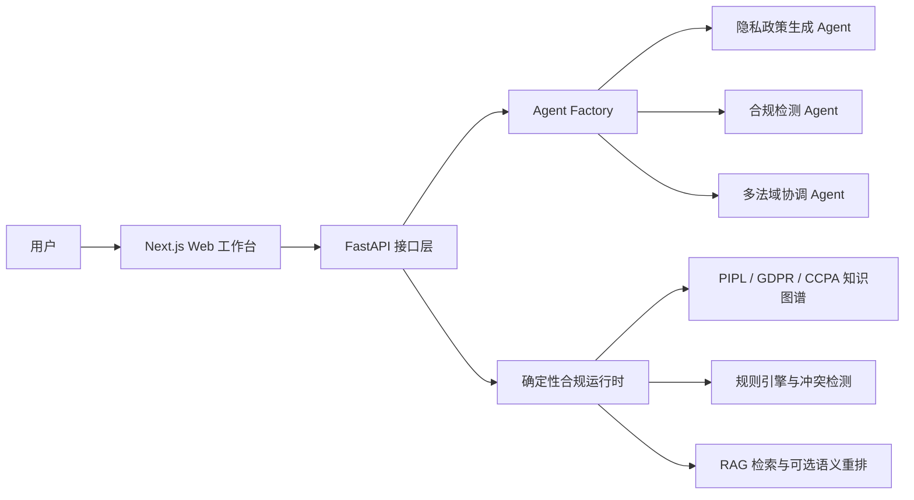

<div align="center">

# PrivLexa

### Multi-Jurisdiction Privacy Policy Intelligence Platform

**隐律智策**——基于大语言模型、多 Agent 与法规知识图谱的隐私政策生成和合规审查平台。


[](LICENSE)

</div>

## 项目简介

PrivLexa 取自 **Privacy + Lex（法律）+ AI**，面向移动应用和互联网产品的隐私政策工作流，将大语言模型分析与确定性规则、法规知识图谱和 RAG 检索结合，提供：

- **隐私政策生成**：根据应用类型、数据类型和目标法域生成政策初稿。
- **多法域合规检测**：支持中国、欧盟和美国法域的并行审查。
- **条款冲突检测**：识别同意、共享、保存期限、用户权利和跨境传输等表述冲突。
- **法规知识图谱与 RAG**：检索相关法规条款，为生成和检测结果提供上下文与可追溯信息。
- **Web 工作台与 REST API**：提供 Next.js 操作界面以及 FastAPI/OpenAPI 接口。

### 支持的法域

| 代码 | 法域 | 主要法规 |
| --- | --- | --- |
| `CN` | 中国 | PIPL《个人信息保护法》 |
| `EU` | 欧盟 | GDPR |
| `US` | 美国（加利福尼亚） | CCPA/CPRA |
| `GLOBAL` | 多法域协调 | PIPL + GDPR + CCPA/CPRA |

## 系统架构



## 技术栈

- **后端**：Python、FastAPI、Uvicorn、Pydantic、Loguru
- **Agent**：Microsoft AutoGen AgentChat
- **模型接入**：OpenAI-compatible API，可配置 DeepSeek、Qwen 等模型服务
- **知识增强**：多法域法规知识图谱、SQLite、RAG、RRF 与可选 Embedding 重排
- **前端**：Next.js 15、React 19、TypeScript、Tailwind CSS、Radix UI
- **测试**：Pytest

## 快速开始

### 1. 获取项目

```bash
git clone <your-repository-url>
cd privlexa
```

### 2. 启动后端

运行环境：Python 3.10 或更高版本。

<details open>
<summary><strong>Windows PowerShell</strong></summary>

```powershell
py -3.10 -m venv .venv
.\.venv\Scripts\Activate.ps1
python -m pip install --upgrade pip
pip install -r requirements.txt
Copy-Item .env.example .env
```

</details>

<details>
<summary><strong>macOS / Linux</strong></summary>

```bash
python3 -m venv .venv
source .venv/bin/activate
python -m pip install --upgrade pip
pip install -r requirements.txt
cp .env.example .env
```

</details>

编辑根目录的 `.env`，至少填写以下配置：

```dotenv
MODEL_API_KEY=your-model-api-key
MODEL_BASE_URL=https://api.deepseek.com
MODEL_NAME=deepseek-chat
```

启动服务：

```bash
python main.py
```

后端默认运行在 `http://localhost:8001`：

- Swagger UI：<http://localhost:8001/docs>
- ReDoc：<http://localhost:8001/redoc>
- 健康检查：<http://localhost:8001/health>

### 3. 启动前端

运行环境：Node.js 18+ 和 npm。

```bash
cd frontend
npm install
```

Windows：

```powershell
Copy-Item .env.example .env.local
npm run dev
```

macOS / Linux：

```bash
cp .env.example .env.local
npm run dev
```

打开 <http://localhost:3000> 即可使用 Web 工作台。前端通过 `BACKEND_URL` 连接后端，默认值为 `http://localhost:8001`。

## 配置说明

模型配置优先从环境变量读取，未覆盖的配置从 [`config/configs.yaml`](config/configs.yaml) 加载。

| 环境变量 | 必填 | 说明 | 示例 |
| --- | :---: | --- | --- |
| `MODEL_API_KEY` | 是 | OpenAI-compatible 模型 API Key | `sk-...` |
| `MODEL_BASE_URL` | 否 | 模型服务地址 | `https://api.deepseek.com` |
| `MODEL_NAME` | 否 | 模型名称 | `deepseek-chat` |
| `MODEL_MAX_TOKENS` | 否 | 最大输出 Token 数 | `8192` |
| `MODEL_TIMEOUT_SECONDS` | 否 | 模型请求超时 | `150` |
| `MODEL_MAX_RETRIES` | 否 | 模型请求重试次数 | `1` |
| `CONFIG_PATH` | 否 | 自定义 YAML 配置文件路径 | `config/configs.yaml` |
| `CORS_ORIGINS` | 否 | 允许的前端来源，逗号分隔 | `http://localhost:3000` |
| `RAG_EMBEDDING_ENABLED` | 否 | 是否启用 Embedding 重排 | `false` |
| `RAG_EMBEDDING_MODEL` | 否 | 本地路径或模型标识 | `sentence-transformers/paraphrase-multilingual-MiniLM-L12-v2` |

也可以继续使用 `QWEN_API_KEY`、`DEEPSEEK_API_KEY` 或 `DASHSCOPE_API_KEY` 等兼容变量，详情见 [`.env.example`](.env.example) 和 [`src/core/config.py`](src/core/config.py)。

### 可选：启用本地语义重排

仓库不会提交本地模型权重。需要语义重排时，可额外安装依赖并通过环境变量指定模型：

```bash
pip install sentence-transformers
```

```dotenv
RAG_EMBEDDING_ENABLED=true
RAG_EMBEDDING_BACKEND=sentence-transformers
RAG_EMBEDDING_MODEL=sentence-transformers/paraphrase-multilingual-MiniLM-L12-v2
```

未启用或模型不可用时，检索流程会回退到图谱/关键词排序。

## API 概览

| 方法 | 路径 | 功能 |
| --- | --- | --- |
| `GET` | `/health` | 服务健康检查 |
| `GET` | `/agents` | 获取可用 Agent |
| `POST` | `/chat` | 与指定 Agent 对话 |
| `POST` | `/api/v2/generate-policy` | 生成隐私政策 |
| `POST` | `/api/v2/compliance-check` | 多法域合规检测 |
| `POST` | `/api/v2/detect-conflicts` | 条款冲突检测 |
| `POST` | `/api/v2/multi-jurisdiction-orchestration` | 多法域任务编排 |
| `GET` | `/api/v2/jurisdictions` | 获取支持的法域 |
| `GET` | `/api/v2/knowledge-graph/stats` | 获取知识图谱统计信息 |
| `POST` | `/api/v2/knowledge-graph/query` | 查询法规知识图谱 |
| `POST` | `/api/v2/retrieve-documents` | 检索相关法规文档 |

完整请求和响应结构可在服务启动后通过 Swagger UI 查看。

### 生成隐私政策

```bash
curl -X POST "http://localhost:8001/api/v2/generate-policy" \
  -H "Content-Type: application/json" \
  -d '{
    "jurisdiction": "CN",
    "app_name": "示例商城",
    "app_type": "电子商务",
    "data_types": ["账号信息", "订单信息", "设备信息"],
    "regions": ["中国"],
    "use_rag": true,
    "additional_context": "包含第三方支付和物流服务"
  }'
```

### 多法域合规检测

```bash
curl -X POST "http://localhost:8001/api/v2/compliance-check" \
  -H "Content-Type: application/json" \
  -d '{
    "policy_title": "示例商城隐私政策",
    "policy_text": "在此填写待检测的隐私政策全文",
    "jurisdictions": ["CN", "EU", "US"],
    "parallel_execution": true,
    "return_markdown": true,
    "enable_conflict_detection": true,
    "detection_mode": "both"
  }'
```

## 项目结构

```text
privlexa/
├── config/                 # 模型、Agent、API 与检索配置
├── frontend/               # Next.js Web 工作台
│   ├── app/                # 页面与 API 代理路由
│   ├── components/         # 页面组件和 UI 组件
│   └── lib/                # 前端 API 模型与工具
├── output/
│   ├── normalized/         # 规范化法规数据和统一知识图谱
│   └── raw/                # 原始法规与语义网络数据
├── prompt/                 # 各类 Agent 的 Prompt
├── scripts/                # 知识图谱构建、数据处理和维护脚本
├── skills/                 # CN / GDPR / CCPA 合规审查技能资料
├── src/
│   ├── agents/             # Agent Factory 与 Agent Builder
│   ├── api/                # FastAPI 路由和数据模型
│   ├── core/               # 配置、RAG、知识图谱、规则引擎等
│   └── app.py              # FastAPI 应用入口
├── tests/                  # 自动化测试
├── main.py                 # 后端启动入口
├── requirements.txt        # Python 依赖
└── README.md
```

## 测试

```bash
pip install pytest
pytest -q
```

## 开发说明

### 添加新的 Agent

1. 在 `src/agents/` 中实现新的 Builder。
2. 在 `prompt/` 中添加对应 Prompt。
3. 在 `AgentFactory` 中注册 Agent 类型。
4. 在 `src/api/models.py` 和 `src/api/routes.py` 中增加接口模型与路由。
5. 为新行为补充测试。

### 重建法规知识图谱

数据处理脚本位于 `scripts/`，其中 `scripts/files/README.md` 记录了规范化流程。统一知识图谱的核心数据位于 `output/normalized/unified_knowledge_graph.json`，SQLite 索引会在需要时重新生成。

## 参与贡献

欢迎通过 Issue 提交问题或建议，也欢迎提交 Pull Request：

1. Fork 本仓库并创建功能分支。
2. 完成修改并补充必要测试。
3. 确保敏感配置、日志、依赖目录和模型权重未被提交。
4. 提交 Pull Request 并说明改动目的。

## 许可证

本项目采用 [Apache License 2.0](LICENSE) 开源许可证。
